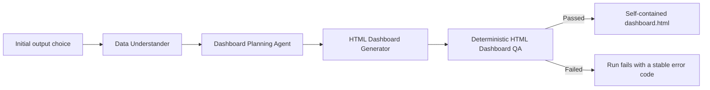

# Multi-Agent Analytics System

This repository converts user-provided CSV datasets into one of two explicitly selected outputs:

1. a decision-oriented analytics report in PDF and PowerPoint; or
2. a self-contained interactive HTML dashboard.

The two runtime paths are isolated after the initial choice. The HTML dashboard path does not create PBIP/PBIR files or call Power BI, Modeling MCP, Desktop Bridge, PDF, PowerPoint, or the Codex self-evolution system.

## Initial output choice

Every interactive run displays this menu before credentials, datasets, or agents are loaded:

```text
Choose an output path:

1. Analytics Report
   - PDF
   - PowerPoint

2. BI Dashboard (HTML)
   - self-contained HTML file
   - interactive filters and charts
   - works offline in a browser
```

Non-interactive callers must explicitly pass `output_path="analytics_report"` or `output_path="html_dashboard"`. New run manifests persist that route. Legacy manifests containing `power_bi` are accepted as a compatibility alias and resume through the HTML dashboard path; no Power BI runtime is constructed.

## Path 1: Analytics Report

The existing nine-stage workflow remains intact:

| Stage | Responsibility |
| --- | --- |
| Data Understander | Profiles the uploaded datasets, identifies fields and data-quality risks, and establishes the analytical context. |
| Market Researcher | Adds relevant external context when market research is enabled and credentials are available. |
| Analysis Planner | Converts the objective and data profile into a testable analysis plan. |
| Data Scientist Coder | Produces dataset-specific, reproducible Python analysis and chart artifacts. |
| Code Reviewer | Checks the analysis for correctness, evidence quality, and runtime safety, then requests bounded repairs when needed. |
| Business Translator | Turns validated statistical findings into clear business implications. |
| Decision Maker | Prioritizes evidence-backed recommendations, actions, risks, and next steps. |
| PDF Report Generator | Builds and validates the detailed decision-oriented PDF report. |
| Slide Deck Generator | Builds and validates the concise executive PowerPoint presentation. |

This path preserves the coder-reviewer loop, evidence bundle, decision recommendations, concurrent PDF/PPTX export, PowerPoint backend selection, artifact receipts, and checkpoint resume behavior.

## Path 2: HTML Dashboard

The dashboard path intentionally uses a smaller isolated workflow:



| Stage | Responsibility |
| --- | --- |
| Data Understander | Creates the shared dataset profile and quality summary without invoking the report exporters. |
| Dashboard Planning Agent | Selects defensible KPIs, filters, pages, fields, aggregations, and chart types from the verified schema. |
| HTML Dashboard Generator | Produces one offline HTML file containing the reviewed rows, responsive layout, filter logic, and native SVG/HTML charts. |
| HTML Dashboard QA Agent | Verifies source fidelity, field references, page density, interactivity, responsive behavior, and the absence of external dependencies. |

The planning agent receives the user objective, aggregate data-understanding output, and a deterministic dataset profile. It has no browser, shell, export, MCP, or filesystem tools. The generator validates all referenced datasets and fields before creating a dashboard.

The generated dashboard:

- is a single self-contained `dashboard.html` file;
- embeds the reviewed CSV rows and needs no local server or network connection;
- provides interactive global filters, KPI cards, charts, page tabs, and a bounded detail table;
- supports bar, line, scatter, and histogram charts;
- keeps at most two charts on each page/tab;
- uses responsive desktop/mobile layout and a print fallback;
- makes no CDN, API, image, font, or script requests;
- escapes embedded data and writes source hashes without exposing credentials;
- is never accompanied by PDF, PPTX, PBIP, PBIR, or Power BI screenshots on this branch.

Deterministic QA verifies the HTML structure, embedded payload, source rows, page and chart counts, responsive layout, filters, semantic fallback, and absence of external network dependencies. A run is marked completed only after `dashboard_qa_receipt.json` passes and `dashboard_success_receipt.json` is written.

### Dashboard charts and interaction

The planning stage matches each visual to the available field types. Unsupported or missing field references are rejected before rendering.

| Chart | Required data | Intended use | Rendering behavior |
| --- | --- | --- | --- |
| Bar | One categorical field, optionally one numeric measure | Compare categories or ranked segments | Shows up to 12 categories using count, sum, mean, minimum, or maximum. |
| Line | One date, numeric, or ordered field plus a numeric measure | Show a time or ordered trend | Sorts the horizontal values and plots an aggregated series. |
| Scatter | Two numeric fields | Inspect relationships, clusters, and outliers | Plots up to 600 filtered observations with point tooltips. |
| Histogram | One numeric field | Show a distribution | Groups the filtered values into 10 equal-width bins. |

Every dashboard page contains no more than two charts. Additional analysis is placed on another tab so titles, labels, and plots remain readable. Global filters recalculate every KPI, chart, and detail table in the browser from the embedded source rows. When a filter leaves no usable observations, the visual displays a clear `No matching data` state instead of a misleading empty plot.

Charts use native browser HTML and SVG rather than remote chart libraries. This keeps the dashboard portable and offline, and the QA checks guard against malformed SVG fills, clipped content, blank visuals, and unexpected network requests.

The default portable limit is 25,000 embedded rows across all datasets. Larger dashboard inputs fail with `HTML_DASHBOARD_TOO_MANY_ROWS` instead of silently sampling or showing misleading filtered metrics. Override the limit only when the resulting file size is acceptable:

```dotenv
HTML_DASHBOARD_MAX_ROWS=25000
HTML_DASHBOARD_STAGE_TIMEOUT_SECONDS=300
```

## Credentials and runtime configuration

Credentials are never requested interactively. They are loaded from:

1. process environment variables;
2. Windows user environment variables;
3. Windows machine environment variables; or
4. the git-ignored project `.env` fallback.

Required names:

```dotenv
OPENROUTER_API_KEY=
BRAVE_API_KEY=
```

Missing credentials fail immediately after the output-path choice and before dataset prompting. Secrets stay in memory and are redacted from logs. Never commit `.env`.

Common non-secret settings are documented in [.env.example](.env.example):

```dotenv
ANALYTICS_MODEL=
STRUCTURED_ANALYTICS_MODEL=
CODE_ANALYTICS_MODEL=
PRESENTATION_ANALYTICS_MODEL=
MARKET_RESEARCH_ENABLED=true
PRESENTATION_ARCHITECT_ENABLED=false
AGENT_REQUEST_TIMEOUT_SECONDS=180
CODE_LOOP_REQUEST_TIMEOUT_SECONDS=900
PRESENTATION_AGENT_TIMEOUT_SECONDS=900
ANALYSIS_TIMEOUT_SECONDS=120
MAX_CSV_BYTES=104857600
MAX_CSV_ROWS=1000000
MAX_CSV_COLUMNS=500
SHARE_SAMPLE_VALUES_WITH_MODEL=false
PRESENTATION_BACKEND=auto
POWERPOINT_MCP_COMMAND=mcp-ppt
HTML_DASHBOARD_STAGE_TIMEOUT_SECONDS=300
HTML_DASHBOARD_MAX_ROWS=25000
```

The default OpenRouter model is `deepseek/deepseek-v3.2`. Dataset sample values are not sent to the model unless `SHARE_SAMPLE_VALUES_WITH_MODEL=true`; column names, types, counts, missingness, ranges, and aggregate profile metadata are still sent.

## Installation and running

Use Python 3.11 (`>=3.11,<3.12`):

```powershell
python -m venv .venv
.venv\Scripts\activate
pip install -r requirements.txt
python -m analytics_workflow
```

Programmatic example:

```python
from pathlib import Path
from analytics_workflow import load_runtime_config, run_non_interactive_workflow

result = run_non_interactive_workflow(
    load_runtime_config(),
    [Path("data.csv")],
    user_data_description="Build an operating dashboard for the main KPIs and drivers.",
    output_path="html_dashboard",
    workspace=Path.cwd(),
)
```

Resume an interrupted run with:

```python
from pathlib import Path
from analytics_workflow import load_runtime_config, resume_non_interactive_workflow

result = resume_non_interactive_workflow(
    load_runtime_config(),
    Path("runs/<run-id>"),
)
```

## Outputs

Report runs write their existing analysis, figures, evidence, PDF, PPTX, QA receipts, and delivery artifacts beneath `runs/<run-id>/`.

Dashboard runs write:

```text
runs/<run-id>/
  dashboard/
    dashboard_events.jsonl
    <project>/
      dashboard.html
      dashboard_plan.json
      render_receipt.json
      dashboard_qa_receipt.json
      dashboard_success_receipt.json
      data/
        <copied source CSV files>
```

`run_manifest.json` checkpoints each stage and records route, status, timestamps, duration, model usage, tokens, cost, errors, and artifact paths. Logs never include API keys.

## Power BI tools retained for Codex only

Power BI is no longer part of the multi-agent analytics runtime. The prior `analytics_workflow.powerbi` package, feature flag, Modeling MCP runtime connection, PBIR authoring stage, Desktop Bridge stage, vision QA stage, and PBIP/PBIR outputs have been removed.

The previously installed Microsoft components remain project-local for direct Codex-assisted Power BI work:

- `@microsoft/powerbi-modeling-mcp@0.5.0-beta.11`
- `@microsoft/powerbi-report-authoring-cli@0.1.4`
- `@microsoft/powerbi-desktop-bridge-cli@0.1.2`
- Microsoft Fabric authoring skill bundle `v0.3.7`

Locations:

- packages and lockfiles: `tools/powerbi/`
- vendored skills and license: `skills/powerbi-authoring/`
- Modeling MCP help utility: `scripts/powerbi_mcp_help.py`
- live Desktop inspection utility: `scripts/powerbi_mcp_live_probe.py`

No global Codex MCP configuration is overwritten by this repository. `tools/powerbi/mcp.runtime.json` and the upstream examples are retained as Codex/tooling references only; the Python analytics runtime does not load them.

Reinstall the pinned Node packages when needed:

```powershell
cd tools\powerbi
npm ci --ignore-scripts --no-audit --no-fund
cd ..\..
```

The Modeling MCP package is a Microsoft preview component with preview license terms. Review `tools/powerbi/component-lock.json`, the packaged licenses, and the vendored skill license before direct use. Power BI Desktop preview settings and Windows compatibility matter only for direct Codex/Power BI work, not for the HTML dashboard runtime.

## PowerPoint generation

The report path retains the existing `PresentationBackend` abstraction:

1. PowerPoint MCP when `PRESENTATION_BACKEND=auto` or `powerpoint_mcp` and the server is available;
2. deterministic `python-pptx` fallback when MCP is unavailable or fails.

The model receives structured deck specifications rather than owning geometry. The renderer controls layout, typography, spacing, chart styling, images, citations, and validation. Unsafe PowerPoint capabilities such as VBA are not exposed. Analytical slides prioritize the workflow's saved evidence figures so slide visuals remain consistent with the PDF.

To force the offline Python renderer:

```dotenv
PRESENTATION_BACKEND=python
```

Generated datasets, dashboards, reports, figures, logs, run folders, and virtual environments are excluded from source control by default.
